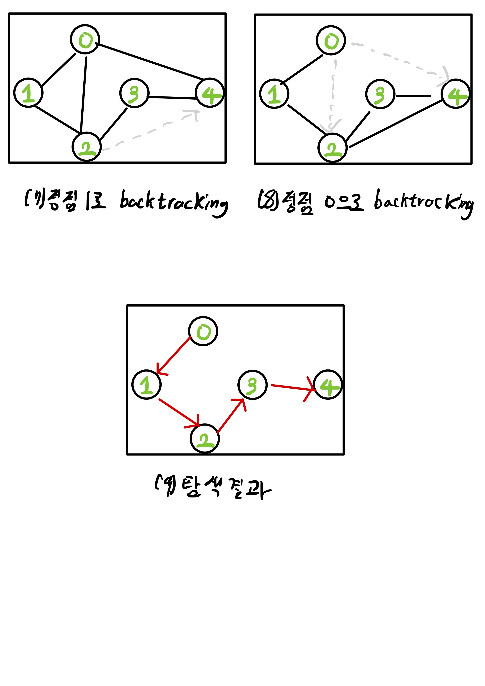

# 궁금하게된 계기
- 백준 문제 풀다가 막혀서 찾아보니 DFS를 이해해야 풀 수 있을거 같았다

 

## 그래프 탐색
- 하나의 정점으로부터 시작하여 차례대로 모든 정점들을 한 번씩 방문
 
 

# 깊이 우선 탐색 DFS(Depth-First Search)
- 한 방향으로 갈 수 있을 때 까지 가다가 더 이상 갈 수 없게 되면 가장 가까운 갈림길로 돌아와서 이곳으로부터 다른 방향으로 다시 탐색
- 되돌아가기 위해서는 스택 필요
- 넓게(wide)탐색하기 전 깊게(deep) 탐색
- 깊이 우선 탐색(DFS)가 너비 우선 탐색(BFS)보다 좀 더 간단함
- 단순 검색 속도는 BFS에 비해 DFS가 느림

 

## DFS 특징
- 자기 자신을 호출하는 순환 알고리즘의 형태를 가지고 있다
- 전위 순회를 포함한 다른 형태의 트리 순회는 모두 DFS의 한 종류
- 어떤 노드를 탐색했었는지에 대한 여부를 반드시 검사해야 함
  - 검사하지 않을 경우 무한루프에 빠질 수 있음

 

## DFS 과정

