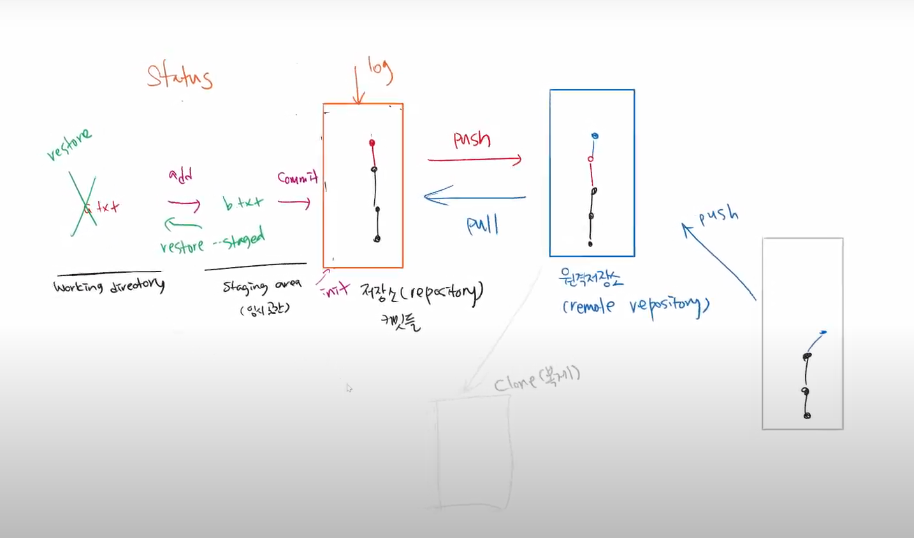

# 2022년 7월 8일


## 디스코드 질문

1. 디스코트 스레드를 활용하여 질문하면 질문을 깔끔히 받을 수 있음

 

##  Syllaverse 질문

1. 질문할때 코드블록을 사용하여 질문을 하면 더 편하고 최대한 구글링을 하고 스스로 할만큼 한 다음 질문해보는 것이 좋다

​	예를 들어 이렇게 함

```
$ git push origin master

remote: Permission to (repository name) denied to (user name)
fatal: unable to access ('repository 주소'): The requested URL returned error: 4
```


## Fork & pull requset

1. `Fork & pull requset` 하는 이유 : 소유하지 않았기 때문

2. Fork 가져옴 -> 이제는 내 저장소에서 관리(Clone-브랜치이동, 작업 -> add -> commit) -> 내 저장소로 push

-> GitHub가서 pull request

shared repo는 초대/권한이 있지만 Fork & pull requset는 소유/권한이 없다



질문 : merge request가 아니라 pull request? : 어떻게 생각하느냐의 차이 `GitLab 용어`에서는 merge request라고 함


## gitkeep/gitignore 사용하는 이유

`gitkeep` : 빈 폴더를 만드는 버전을 하고 싶어서, git을 효율적으로 관리하기 위해서 파일을 기준으로 만들기 때문(빈 폴더는 아무런 의미가 없기 때문), gitkeep는 관용적이기 때문에 이름 바꾸기 가능하다

`gitignore` : git으로 추적하기 않는 파일 관리, git은 모든 하위 디렉토리의 파일을 추적하기 때문, gitignore는 이름을 바꾸지 못함


---


## 취업특강 채용 시장 변화(공채 -> 역량)

4차 산업혁명 시대(직무역량 중심 채용의 시대)

회사에 들어가지 않고도 기술을 학습할 수 있는 시대

공채가 저물고 직무 역량으로 검증하는 수시 채용 시대

생태계가 변했기 때문에 누구나 기술을 배워서 기술활용이 가능해짐

공채 시대가 사라질수도 있음,

회사에서 경력직 중심으로 채용하는 이유 : 역량 추정이 가능하기 때문, `대외활동, 봉사, 자격증, 학교 등`이 점점 직무 역량과 관련없어짐, 근면함을 보여주는 지표, 하지만 실제로 기업입장에서 일잘하는 지표가 안됨

신입일 경우 역량을 검증할 방법 : `프로젝트` 

`프로젝트` : 자기를 소개하는 것이 아닌 자기가 한 것을 소개하는 것

`GitGub` : 프로그래밍을 한다면 자기소개서 및 포트폴리오이자 내 프로젝트를 공유하는 공간


## 학습 공식

1. 공고확인 - 내가 가진것

   기업에서 원하는 역량을 파악하고 나의 역량과 비교

   직장 < 커리어 < 삶

   어떤 직장에 가고 싶다보다 원하는 기업에 이미 개발자라고 생각하고 준비하는 것이 좋다

   그렇다면 해당 기업 개발자는 어떻게 일하는지 생각하고 학습의 목표를 맞춰야 함

​		[토스 개발자 인터뷰](https://www.youtube.com/results?search_query=slash+21)

2. MOOC(Massive Opensource Online Course)

​		[Coursera](https://www.coursera.org/) 미국 스탠포드(딥러닝), Jihns Hopkins, Upenn, 등

​		[edx](https://www.edx.org/) 미국 동부(파이썬 강의 재밌음)

​		[Udacity](https://www.udacity.com/) 실리콘벨리 기술의 끝(자율주행, 비행자동차 등등 많음)

​			[머신러닝 기초 수업](https://www.youtube.com/watch?v=ICKBWIkfeJ8&list=PLAwxTw4SYaPkQXg8TkVdIvYv4HfLG7SiH)

​			[자율주행 자동차 대회](https://www.darpa.mil/about-us/timeline/-grand-challenge-for-autonomous-vehicles)

​		[CS50](https://www.youtube.com/c/cs50) 하버드 강의, 컴공생이면 서브자료로 들으면 도움됨

​		[K-MOOC](http://www.kmooc.kr/)

​		멘토분들에게 추가적인 강의를 듣고 싶은데 MOOC강의 도움되는거 있는지 여쭤보기

3. 도울될만한 사이트

​		[codecademy 파이썬 공부](https://www.codecademy.com/catalog/language/python)

​		[프로그래머스](https://programmers.co.kr/)


## 취업 절대 공식

1. `GitHub TIL`을 1.5년 이상 지속
2. (나의 언어로) 타인에게 설명할 수 있는 SW 역량
3. 유저가 실사용 하는 프로젝트를 개발 & 유지보수


## 프로젝트

1. 의외로 간단한 주제로 하면 성공할 수 있다
2. 주변의 문제를 해결하는 프로젝트를 하자
3. 내가 매번 사용할만한 프로젝트?

​	ex. `구닥(Gudak)`: 필름카메라처럼 사진이 저장되는 앱

​	ex. `비프로 일레븐`


## SW 분야

1. Frontend 

   서비스의 앞부분을 만드는 분야

   HTML, CSS, JavaScript를 통해 화면 구성하고 동작

   React, Vue 등의 역량 필요

2.  Backend

   서비스의 뒷부분을 만드는 분야

   Java, Python, Ruby 등

   Spring, Django, Ruby on Rails 등의 역량 필요

3. DevOps

​		Dev(개발) + Ops(운영)

​		배포, 스케일 인/아웃, 모니터링 등의 인프라 분야

​		Docker, Kubernetes, Jenkins 등의 역량 필요

4. Data Scientist

​		쌓여있는 데이터를 의미있는 데이터로 도출하는 분야

​		vs 데이터 엔지니어 : 데이터의 수집/가공/저장이 주 업무

​		데이터 전처리, 모델 학습, ML 파이프라인 구축 등을 담당

​		Python, Tensorflow, Pytorch, Kubeflow 등의 역량 필요


## SW 직군 채용 공고 사이트

[원티드](https://www.wanted.co.kr/) : IT 서비스기업, 스타트업 위주

[로켓펀치](https://www.rocketpunch.com/)

[프로그래머스](https://programmers.co.kr/) : 개발자 전용 구인구직 사이트 / 각종 강좌, 코딩테스트 문제 제공

[점핏](https://www.jumpit.co.kr/)

[자소설닷컴](https://jasoseol.com/) : 대기업, 공기업 위주

[Linkedin](https://kr.linkedin.com/)

[사람인]([https://www.saramin.co.kr](https://www.saramin.co.kr/))

[잡코리아](https://www.jobkorea.co.kr/)

직군별 자격요건과 우대사항을 분석하고 GitHub에 기록

100억 이하 투자받은 회사는 지양하는게 좋음..

R&R : Role(역할) and Responsibilities(책임)

​	추가되야할 것 : Requirements요구사항 - Good to have(우대사항)


## 실습 1. 공고 사이트 가입 & 채용 공고 리서치

여러 공고 사이트 가입 후, 직군을 최소 1개 이상 선택(ex. 프론트엔드, 백엔드, 데브옵스 등)

선택 직군 관련 공고 10개 이상 찾아서, 공통 자격요건/우대사항 정리 -> Github에 커밋

​	repository 명: `job-research`

​	정리 파일명: [`research.md`](http://research.md)

공고 사이트 프로필 업데이트(선택사항)

일반적인 공고 사이트보다 개발전문 사이트들이 더 세부사항적으로 잘 나뉘어져있음
