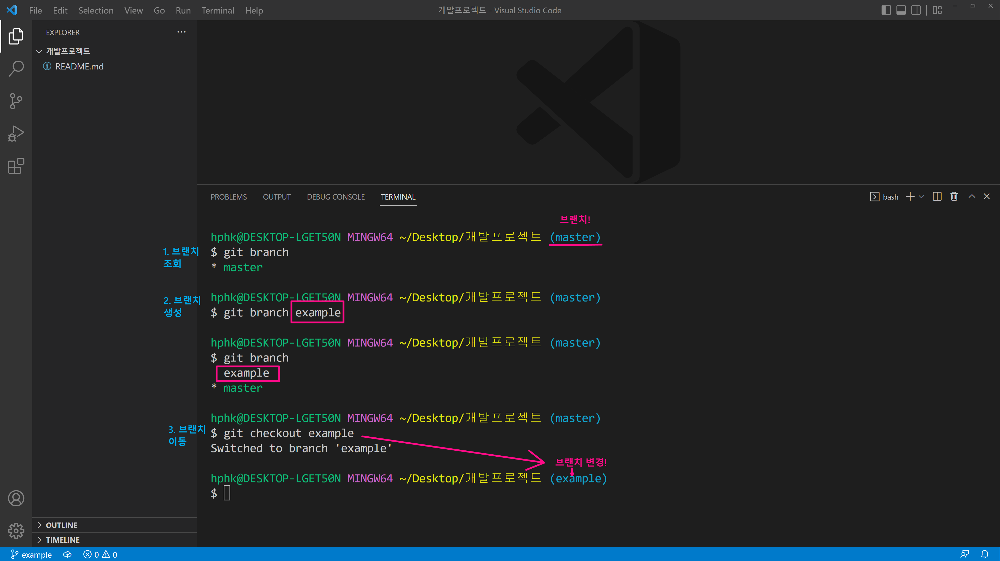
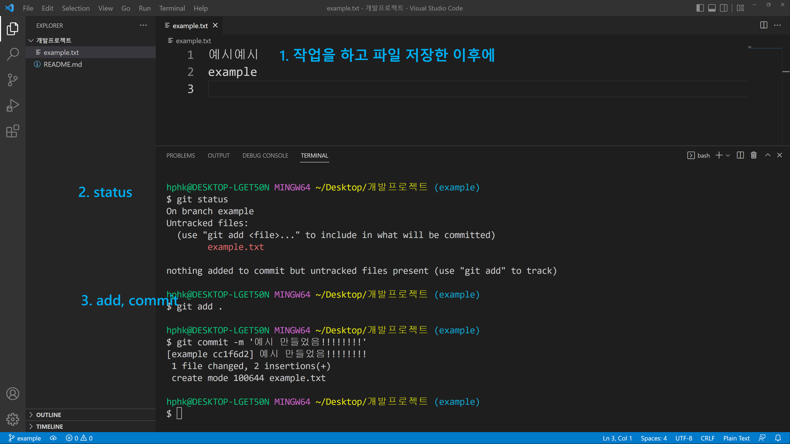
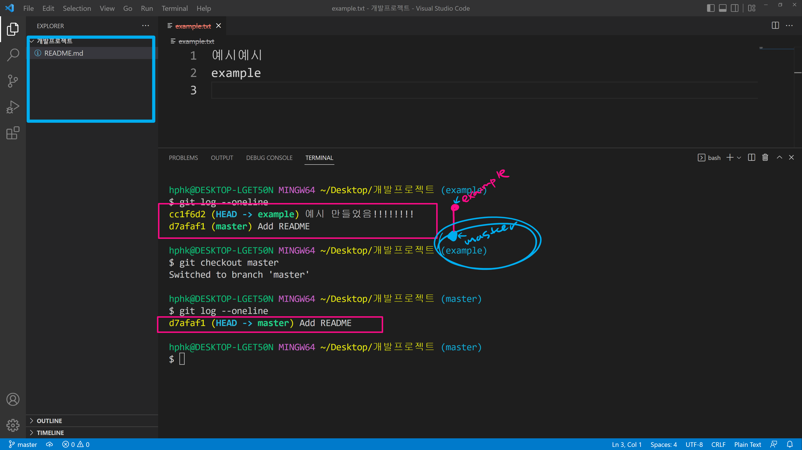
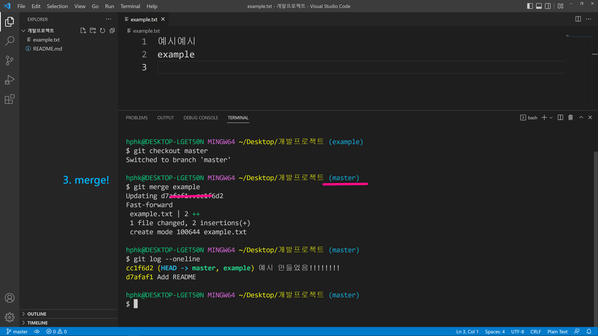

# 2022년 7월 7일

## 어제 수업 중 궁금한 것

수업 종료 후 모르는 것을 구글링을 하며 찾아봄, 수업시간 때 배운 명령어 말고 아주 다양한 명령어가 있었음.

그 중 `gitignore`의 정확한 개념을 모르겠음

강사님께서 다른사람과 비교하기보다 어제의 나와 비교하여 더욱 더 성장하였는지 살펴보라고 하셨는데

스스로 생각을 해보니 매일매일 새로운 것을 배우고 100% 습득하지는 못했지만 git ,github,Typora 등과 같이 다양한 것을 배웠고 매일 상승 곡선을 타고 있는것 같아서 꾸준히 열심히 해봐야겠다

---


# 커밋이란

Git : 분산버전(커밋)관리시스템 -> repository(저장소)

repository(저장소)엔 해쉬값(ex. ad34cd-dc124qq-...)커밋


파일들이 수정되면 (1통) = modified = working directory

-> add -> (2통) = 임시공간 = staging area


지금까지 버전을 만들고 github에 올리는 앞으로 가는 과정을 배웠고 오늘인지 모르겠지만 다음 시간에 버전을 되돌리는 방법을 배울거 같음


강사님께서 처음부터 어떻게 파일 생성하고 깃허브까지 커밋하는지 알려주심

중간에 `$ git add .`만 하는 줄 알았는데 `$ git add <해당 파일1_해당 파일2>`이렇게 해도 됨

지금까지 왜 `$ git add .`이 커맨드를 사용했는지... 앞으론 하나씩 해야겠다

중간에 수정할때는 `$ git add .`을 사용하심

제대로 다시 알아봐야할거 같음


Typora에서 파일자체의 폴더나 파일을 이동시키면 당연하게 이미지의 경로가 바뀌기때문에 이미지가 안보임

그 이유는 이미지들이 모두 경로로 설정되어 있기때문, 보통 asserts폴더에 저장되어 있다


러버덕 디버깅 ㅋㅋㅋ : **러버덕 디버깅**은 고무 오리를 사용하여 문제가 있는 부분을 **디버깅**하는 것


강사님의 Github를 내 컴퓨터에서 사용하고 싶으면 clone


## clone 주의!

1. 클론하면 원격저장소 이름의 폴더가 생성

데스트탑에서 여는 것이 아닌 TIL에서 열어야됨

`zip`파일에서 받아온거랑 `clone`해서 파일 받아온거랑 다름

`zip`과 `clone`의 차이점은 파일 안에 보면 `.git` 즉, master이 없다

`zip` : 최선버전의 파일 폴더

`clone` : git과 저장소, 버전들을 가지고 올 수 있음


`$ git clone <url>`

이거할때 사용하고 있는 폴더에서 하면안됨 

바탕화면에 할 경우 바탕화면에서 git bash나 vs code를 열어서 실행


강사님 TIL-kdt-1을 다운 받고

계속하여 업데이트를 받으려면 `$ git pull origin master` 하면됨


여기서 `pull`과 `clone`의 차이점

`pull` : 커밋된 내용 받아옴

`clone` : 저장소 받아옴


**~오전 실습**

---

작업을 할 때 브랜치를 나눠서 하는 것이 일반적임

오후 시간엔 `Branch`를 배울거 같음


첫 번째 커밋을 `root-commit`이라고 터미널에 뜸

`git branch` : 브랜치  조회

평소 `init`하면 `master`가 뜨는 부분이 브랜치를 의미한다고 할 수 있다

`git branch <생성할 브랜치명>` : 브랜치 생성

브랜치를 생성하면 `master`인 부분이 `<생성할 브랜치명>`으로 변경됨



1. 작업하고 파일 저장한 이후
2. status
3. add, commit



`$ git checkout master`하면 `example.txt`파일이 없어짐




master은 기준이 되는 뿌리,기둥라고 생각하고

example 같은 것들은 기둥에서 뻗어나간 가지라고 생각


`$ git merge example`하면 병합된다




`$ git branch -d example`로 example 브랜치를 지워도 이미 병합했기 때문에 커밋된 내용은 지워지지 않는다


브랜치란 것은 특정한 버전의 작업 흐름이고

예를 들면 조모임이다


같은 파일이 수정되면 자연스럽게 합쳐질 수 없다, 따라서 조모임에서 조장이 취합을 해줘야함

4학년 실제 졸업과제에서 다른 팀원 2명이 따로 ppt를 만들어줘서 내가 합친거랑 같은 개념


하나의 선에서 여러 개로 분할 작업을하고 나중에 merge라는 과정 즉, 병합을 통해 하나의 선으로 다시 이어주는 과정을

git에서 할 수 있다.

음 2개의 n개의 버전을 합쳤다고 생각


github사이트에 `mater`이면 소유권이 있고, `main`면 소유권이 없다


github 사이트에서 `Fork`  눌러서 저장소를 `clone`함 

그럼 터미널에서 `(main)`으로 뜸

그럼 여기서 `$ git add .`-> `$ git commit -m '<적을이름>'` -> `$git pull origin main` 여기서 origin은 본인이다


# Git branch

## 1. branch 관련 명령어

> Git 브랜치를 위해 root-commit을 발생시키고 진행하세요.

```
$ git init
(master) $ touch README.md
(master) $ git add .
(master) $ git commit -m 'Init'
```

1. 브랜치 생성

   ```
   (master) $ git branch {브랜치명}
   ```

2. 브랜치 이동

   ```
   (master) $ git checkout {브랜치명}
   ```

3. 브랜치 생성 및 이동

   ```
   (master) $ git checkout -b {브랜치명}
   ```

4. 브랜치 삭제

   ```
   (master) $ git branch -d {브랜치명}
   ```

5. 브랜치 목록

   ```
   (master) $ git branch
   ```

6. 브랜치 병합

   ```
   (master) $ git merge {브랜치명}
   ```

   - master 브랜치에서 {브랜치명}을 병합

## 2. branch 병합 시나리오

> branch 관련된 명령어는 간단하다.
>
> 다양한 시나리오 속에서 어떤 상황인지 파악하고 자유롭게 활용할 수 있어야 한다.

### 상황 1. fast-foward

> fast-foward는 feature 브랜치 생성된 이후 master 브랜치에 변경 사항이 없는 상황

1. feature/home branch 생성 및 이동

   ```
   (master) $ git branch feature/home
   (master) $ git checkout feature/home
   ```

2. 작업 완료 후 commit

   ```
   (feature/home) $ touch home.txt
   (feature/home) $ git add .
   (feature/home) $ git commit -m 'Add home.txt'
   (feature/home) $ git log --oneline
   b534a34 (HEAD -> feature/home) Complete Home!!!!
   e89616a (master) Init
   ```

3. master 이동

   ```
   (feature/home) $ git checkout master
   (master) $ git log --oneline
   ```

4. master에 병합

   ```
   (master) $ git merge feature/home 
   Updating e89616a..b534a34
   Fast-forward
    home.txt | 0
    1 file changed, 0 insertions(+), 0 deletions(-)
    create mode 100644 home.txt
   ```

5. 결과 : fast-foward

   ```
   (master) $ git log --oneline
   b534a34 (HEAD -> master, feature/home) Complete Home!!!!
   e89616a Init
   ```

6. branch 삭제

   ```
   (master) $ git branch -d feature/home 
   Deleted branch feature/home (was b534a34).
   ```

------

### 상황 2. merge commit

> 서로 다른 이력(commit)을 병합(merge)하는 과정에서 **다른 파일이 수정**되어 있는 상황
>
> git이 auto merging을 진행하고, **commit이 발생된다.**

1. feature/about branch 생성 및 이동

   ```
   (master) $ git checkout -b feature/about
   (feature/about) $
   ```

2. 작업 완료 후 commit

   ```
   (feature/about) $ touch about.txt
   (feature/about) $ git add .
   (feature/about) $ git commit -m 'Add about.txt'
   (feature/about) $ git log --oneline
   5e1f6de (HEAD -> feature/about) 자기소개 페이지 완료!
   b534a34 (master) Complete Home!!!!
   e89616a Init
   ```

3. master 이동

   ```
   (feature/about) $ git checkout master
   (master) $
   ```

4. *master에 추가 commit 이 발생시키기!!*

   - **다른 파일을 수정 혹은 생성하세요!**

   ```
   (master) $ touch master.txt
   (master) $ git add .
   (master) $ git commit -m 'Add master.txt'
   (master) $ git log --oneline
   98c5528 (HEAD -> master) 마스터 작업....
   b534a34 Complete Home!!!!
   e89616a Init
   ```

5. master에 병합

   ```
   (master) $ git merge feature/about
   ```

6. 결과 -> 자동으로 *merge commit 발생*

7. 커밋 및 그래프 확인하기

   ```
   $ git log --oneline --graph
   *   582902d (HEAD -> master) Merge branch 'feature/about'
   |\
   | * 5e1f6de (feature/about) 자기소개 페이지 완료!
   * | 98c5528 마스터 작업....
   |/
   * b534a34 Complete Home!!!!
   * e89616a Init
   ```

8. branch 삭제

   ```
   $ git branch -d feature/about 
   Deleted branch feature/about (was 5e1f6de).
   ```

------

### 상황 3. merge commit 충돌

> 서로 다른 이력(commit)을 병합(merge)하는 과정에서 **같은 파일의 동일한 부분이 수정**되어 있는 상황
>
> git이 auto merging을 하지 못하고, 충돌 메시지가 뜬다.
>
> 해당 파일의 위치에 표준형식에 따라 표시 해준다.
>
> 원하는 형태의 코드로 직접 수정을 하고 직접 commit을 발생 시켜야 한다.

1. feature/test branch 생성 및 이동

   ```
   (master) $ git checkout -b feature/test
   ```

2. 작업 완료 후 commit

   ```
   # README.md 파일 열어서 수정
   (feature/test) $ touch test.txt
   (feature/test) $ git add .
   (feature/test) $ git commit -m 'Add test.txt'
   (feature/test) $ git log --oneline
   95fad1c (HEAD -> feature/test) README 수정하고 test 작성하고
   582902d (master) Merge branch 'feature/about'
   98c5528 마스터 작업....
   5e1f6de 자기소개 페이지 완료!
   b534a34 Complete Home!!!!
   e89616a Init
   ```

3. master 이동

   ```
   $ git checkout master
   ```

4. *master에 추가 commit 이 발생시키기!!*

   - **동일 파일을 수정 혹은 생성하세요!**

   ```
   # README.md 파일 열어서 수정
   (master) $ git add README.md
   (master) $ git commit -m 'Update README.md'
   ```

5. master에 병합

   ```
   (master) $ git merge feature/test 
   Auto-merging README.md
   CONFLICT (content): Merge conflict in README.md
   Automatic merge failed; fix conflicts and then commit the result.
   ```

6. 결과 -> *merge conflict발생*

   > git status 명령어로 충돌 파일을 확인할 수 있음.

   ```
   (master|MERGING) $ git status
   On branch master
   You have unmerged paths.
     (fix conflicts and run "git commit")        
     (use "git merge --abort" to abort the merge)
   
   Changes to be committed:
           new file:   test-1.txt
           new file:   test-2.txt
           new file:   test.txt
   
   Unmerged paths:
     (use "git add <file>..." to mark resolution)
           both modified:   README.md
   ```

7. 충돌 확인 및 해결

   ```
   <<<<<<< HEAD
   # 마스터에서 작업함...
   =======
   # 테스트에서 작성
   >>>>>>> feature/test
   ```

   => 나보고 고치라는 것인가 학생^^?

8. merge commit 진행

   ```
   (master|MERGING) $ git add .
   (master|MERGING) $ git commit
   ```

   - vim 편집기 화면이 나타납니다.
     - 자동으로 작성된 커밋 메시지를 확인하고, `esc`를 누른 후 `:wq`를 입력하여 저장 및 종료를 합니다.
     - `w` : write
     - `q` : quit
   - vs code 편집기에서 메시지보고 닫아주세요~!

9. 커밋 및 확인하기

   ```
   (master) $ git log --oneline --graph
   *   bc1c0cd (HEAD -> master) Merge branch 'feature/test'
   |\  
   | * 95fad1c (feature/test) README 수정하고 test 작성하고
   * | 2ecad28 리드미 수정
   |/  
   *   582902d Merge branch 'feature/about'
   |\  
   | * 5e1f6de 자기소개 페이지 완료!
   * | 98c5528 마스터 작업....
   |/  
   * b534a34 Complete Home!!!!
   * e89616a Init
   ```

10. branch 삭제

    ```
    (master) $ git branch -d feature/test
    ```

